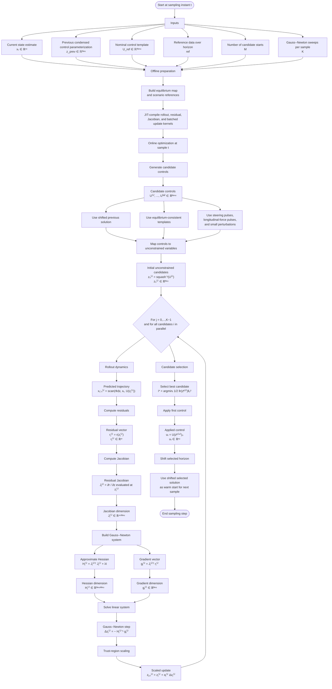

# Introductioin 

Autonomous drifting is a challenging benchmark for advanced vehicle control because it intentionally operates the vehicle beyond the conventional stable-handling region. Unlike typical autonomous-driving controllers, which aim to limit tire slip and preserve lateral stability within near-linear tire-force regimes, drifting requires the deliberate generation and regulation of large sideslip angles while maintaining path tracking, yaw-rate stability, and actuator feasibility. Thus, drifting is relevant not only for aggressive maneuvering but also as a stress test for safety-critical control under emergency conditions, where vehicles may operate near or beyond tire saturation. Understanding and controlling vehicle motion in these regimes can improve robustness during extreme maneuvers, low-friction driving, obstacle avoidance, and loss-of-control recovery [1].

From a control-theoretic perspective, drifting is challenging because the vehicle dynamics are strongly nonlinear, practically underactuated, and highly sensitive to tire–road interactions. At large sideslip angles, tire forces become nonlinear and coupled through friction limits, load transfer, and saturation. So small changes in steering, throttle, braking, or road friction can cause large variations in yaw moment and sideslip dynamics. Moreover, steady-state drift conditions may correspond to unstable, saddle-type equilibria, requiring continuous feedback stabilization rather than simple reference tracking [2]. This fundamentally distinguishes autonomous drifting from conventional path-following control, which typically assumes operation near stable nominal motion.


Within this research direction, nonlinear model predictive control is appealing because it can integrate nonlinear vehicle dynamics, state and input constraints, actuator limits, path-tracking objectives, and stability-related penalties within a single receding-horizon optimization framework. However, this expressiveness comes with substantial computational cost, as NMPC must solve a nonlinear optimal control problem at each sampling instant with sufficient speed and accuracy for closed-loop operation. This creates a key challenge for autonomous drifting: the controller must be both dynamically expressive and numerically reliable in a highly sensitive regime.

Consequently, autonomous drifting is  a spectacular aggressive-driving maneuver. And, also it is a rigorous benchmark for nonlinear predictive control. A successful controller must stabilize an intrinsically unstable high-sideslip motion, manage nonlinear tire-force saturation, resolve competing path-tracking and drift-stabilization objectives, and do so under real-time computational constraints. These properties make drifting an ideal testbed for evaluating NMPC algorithms, solver warm-start strategies. Real time embedded optimal-control software/solver such as acados implementats with fast multiple-shooting NMPC with sensitivities and RTI-class solvers for embedded execution and focuses on efficient SQP/RTI implementations for general NMPC.This work studies a narrower question: whether a drifting NMPC solve can be reorganized as a compiled differentiable program that supports batched multi-start exploration and low-latency Gauss–Newton real-time iteration in JAX. 


Therefore, this works contributes on a solver organization for autonomous drifting NMPC. Specifically, the project formulates the drifting NMPC solve as a compiled differentiable program in JAX, combining batched candidate generation with a Gauss–Newton real-time iteration update. This organization makes the compile/runtime trade-off explicit, which is often hidden in classical external-solver workflows. It further exploits JAX transformations such as : `jit` for compiling fused numerical kernels, `vmap` for batched candidate evaluation, `scan` for compact fixed-horizon rollout, and checkpointing for memory–computation trade-offs during reverse-mode differentiation.


# Vehicle Model 

# Seven-State Dynamic Single-Track Vehicle Model

## 1. Complete Symbol Table

| Symbol | Description | Unit |
|---|---|---|
| $x$ | State vector | — |
| $u$ | Control input vector | — |
| $X$ | Global x-position of the vehicle center of mass | m |
| $Y$ | Global y-position of the vehicle center of mass | m |
| $\dot{X}$ | Global x-direction velocity | m/s |
| $\dot{Y}$ | Global y-direction velocity | m/s |
| $\psi$ | Yaw angle of the vehicle measured in the inertial frame | rad |
| $\dot{\psi}$ | Time derivative of yaw angle | rad/s |
| $v_x$ | Longitudinal velocity in the vehicle body-fixed frame | m/s |
| $v_y$ | Lateral velocity in the vehicle body-fixed frame | m/s |
| $\dot{v}_x$ | Longitudinal acceleration in the body-fixed frame | m/s² |
| $\dot{v}_y$ | Lateral acceleration in the body-fixed frame | m/s² |
| $r$ | Yaw rate of the vehicle | rad/s |
| $\dot{r}$ | Yaw acceleration | rad/s² |
| $\delta$ | Front steering angle | rad |
| $\dot{\delta}$ | Actual steering rate | rad/s |
| $\dot{\delta}_{cmd}$ | Commanded steering rate | rad/s |
| $\dot{\delta}_{max}$ | Maximum allowable steering rate | rad/s |
| $F_{x,r}$ | Rear longitudinal tire force | N |
| $F_{y,f}$ | Front lateral tire force | N |
| $F_{y,r}$ | Rear lateral tire force | N |
| $F_{\mathrm{drag}}(v_x)$ | Longitudinal rolling/aerodynamic resistance force | N |
| $m$ | Vehicle mass | kg |
| $I_z$ | Yaw moment of inertia about the vertical axis | kg m² |
| $\ell_f$ | Distance from vehicle center of mass to front axle | m |
| $\ell_r$ | Distance from vehicle center of mass to rear axle | m |
| $c_1$ | Linear longitudinal resistance coefficient | N s/m |
| $c_2$ | Quadratic longitudinal resistance coefficient | N s²/m² |
| $\alpha_f$ | Front tire slip angle | rad |
| $\alpha_r$ | Rear tire slip angle | rad |
| $\beta$ | Body sideslip angle | rad |
| $\epsilon$ | Small positive regularization constant used to avoid division by zero | m/s |
| $F_{y,i}$ | Lateral tire force at axle $i$ | N |
| $D_i$ | Tire-force amplitude parameter at axle $i$ | N |
| $B_i$ | Tire stiffness-shape parameter at axle $i$ | 1/rad |
| $C_i$ | Tire shape parameter at axle $i$ | — |
| $i$ | Axle index, where $i \in \{f,r\}$ | — |
| $D_f$ | Front lateral tire-force amplitude | N |
| $D_r$ | Rear lateral tire-force amplitude | N |
| $\mu$ | Tire-road friction coefficient | — |
| $F_{z,f}$ | Static normal load on the front axle | N |
| $F_{z,r}$ | Static normal load on the rear axle | N |
| $g$ | Gravitational acceleration | m/s² |
| $\mathrm{sat}(\cdot)$ | Steering-rate saturation function | — |

---
The model below describes seven-state dynamic single-track vehicle model planar vehicle motion using global position, yaw orientation, body-frame translational velocities, yaw rate, and front steering angle.

The model is written in continuous-time nonlinear state-space form as

```math
\dot{x} = f(x,u)
```

with state vector

```math
x =
\begin{bmatrix}
X & Y & \psi & v_x & v_y & r & \delta
\end{bmatrix}^{T}
```

and control input vector

```math
u =
\begin{bmatrix}
\dot{\delta}_{cmd} & F_{x,r}
\end{bmatrix}^{T}.
```
--- 

The continuous-time vehicle dynamics are

```math
\dot{X}
=
v_x \cos \psi
-
v_y \sin \psi,
```

```math
\dot{Y}
=
v_x \sin \psi
+
v_y \cos \psi,
```

```math
\dot{\psi}
=
r,
```

```math
\dot{v}_x
=
\frac{
F_{x,r}
-
F_{y,f}\sin\delta
-
F_{\mathrm{drag}}(v_x)
}{m}
+
r v_y,
```

```math
\dot{v}_y
=
\frac{
F_{y,f}\cos\delta
+
F_{y,r}
}{m}
-
r v_x,
```

```math
\dot{r}
=
\frac{
\ell_f F_{y,f}\cos\delta
-
\ell_r F_{y,r}
}{I_z},
```

```math
\dot{\delta}
=
\mathrm{sat}
\left(
\dot{\delta}_{cmd}
\right).
```

Equivalently, the complete nonlinear vector field can be written as

```math
\dot{x}
=
\begin{bmatrix}
\dot{X} \\
\dot{Y} \\
\dot{\psi} \\
\dot{v}_x \\
\dot{v}_y \\
\dot{r} \\
\dot{\delta}
\end{bmatrix}
=
\begin{bmatrix}
v_x \cos \psi - v_y \sin \psi \\

v_x \sin \psi + v_y \cos \psi \\

r \\

\dfrac{
F_{x,r}
-
F_{y,f}\sin\delta
-
F_{\mathrm{drag}}(v_x)
}{m}
+
r v_y \\

\dfrac{
F_{y,f}\cos\delta
+
F_{y,r}
}{m}
-
r v_x \\

\dfrac{
\ell_f F_{y,f}\cos\delta
-
\ell_r F_{y,r}
}{I_z} \\

\mathrm{sat}
\left(
\dot{\delta}_{cmd}
\right)
\end{bmatrix}.
```

---

The variables $v_x$ and $v_y$ are expressed in the vehicle body-fixed frame. The global position dynamics are obtained by rotating the body-frame velocity vector into the inertial frame:

```math
\begin{bmatrix}
\dot{X} \\
\dot{Y}
\end{bmatrix}
=
\begin{bmatrix}
\cos\psi & -\sin\psi \\
\sin\psi & \cos\psi
\end{bmatrix}
\begin{bmatrix}
v_x \\
v_y
\end{bmatrix}.
```

This gives

```math
\dot{X}
=
v_x \cos\psi
-
v_y \sin\psi,
```

```math
\dot{Y}
=
v_x \sin\psi
+
v_y \cos\psi.
```

The yaw kinematics are

```math
\dot{\psi}
=
r.
```

---

The longitudinal body-frame dynamics are

```math
\dot{v}_x
=
\frac{
F_{x,r}
-
F_{y,f}\sin\delta
-
F_{\mathrm{drag}}(v_x)
}{m}
+
r v_y.
```

The term $F_{x,r}$ is the rear longitudinal force generated by propulsion or braking.

The term $-F_{y,f}\sin\delta$ is the longitudinal projection of the front lateral tire force caused by the steering angle $\delta$.

The term $-F_{\mathrm{drag}}(v_x)$ represents rolling and aerodynamic resistance.

The term $r v_y$ is a body-frame inertial coupling term caused by the rotating vehicle coordinate frame.

---

The lateral body-frame dynamics are

```math
\dot{v}_y
=
\frac{
F_{y,f}\cos\delta
+
F_{y,r}
}{m}
-
r v_x.
```

The term $F_{y,f}\cos\delta$ is the lateral projection of the front tire force.

The term $F_{y,r}$ is the rear lateral tire force.

The term $-r v_x$ is the lateral inertial coupling term caused by expressing the translational dynamics in the rotating body-fixed frame.

---

The yaw dynamics are obtained from the rotational equation of motion about the vertical axis through the vehicle center of mass:

```math
I_z \dot{r}
=
M_z.
```

The net yaw moment is

```math
M_z
=
\ell_f F_{y,f}\cos\delta
-
\ell_r F_{y,r}.
```

Thus,

```math
\dot{r}
=
\frac{
\ell_f F_{y,f}\cos\delta
-
\ell_r F_{y,r}
}{I_z}.
```

The front lateral tire force produces the yaw moment contribution $\ell_f F_{y,f}\cos\delta$, while the rear lateral tire force produces the yaw moment contribution $-\ell_r F_{y,r}$.

---

The steering angle is treated as a dynamic state. Its evolution is governed by

```math
\dot{\delta}
=
\mathrm{sat}
\left(
\dot{\delta}_{cmd}
\right).
```

Here, $\dot{\delta}_{cmd}$ is the commanded steering rate, while $\mathrm{sat}(\cdot)$ limits the commanded steering rate according to actuator constraints.

A symmetric steering-rate saturation model can be written as

```math
\mathrm{sat}
\left(
\dot{\delta}_{cmd}
\right)
=
\begin{cases}
\dot{\delta}_{max},
&
\dot{\delta}_{cmd}
>
\dot{\delta}_{max},
\\

\dot{\delta}_{cmd},
&
-\dot{\delta}_{max}
\leq
\dot{\delta}_{cmd}
\leq
\dot{\delta}_{max},
\\

-\dot{\delta}_{max},
&
\dot{\delta}_{cmd}
<
-\dot{\delta}_{max}.
\end{cases}
```

---

A simple rolling/aerodynamic resistance term is included only in the longitudinal dynamics. It is used to make the closed-loop equilibrium for the abstract rear-axle longitudinal-force input numerically meaningful in the reduced model.

The resistance force is modeled as

```math
F_{\mathrm{drag}}(v_x)
=
c_2 v_x^2
+
c_1 v_x.
```

The term $c_2 v_x^2$ represents a quadratic aerodynamic-resistance contribution, while $c_1 v_x$ represents a linear rolling or viscous-resistance contribution.

---

The front and rear tire slip angles are defined as

```math
\alpha_f
=
\arctan
\left(
\frac{
v_y + \ell_f r
}{
\max(v_x,\epsilon)
}
\right)
-
\delta,
```

```math
\alpha_r
=
\arctan
\left(
\frac{
v_y - \ell_r r
}{
\max(v_x,\epsilon)
}
\right).
```

The term $\max(v_x,\epsilon)$ prevents numerical singularities when the longitudinal speed approaches zero.

The front slip angle $\alpha_f$ depends on the lateral velocity at the front axle, $v_y+\ell_f r$, and the steering angle $\delta$.

The rear slip angle $\alpha_r$ depends on the lateral velocity at the rear axle, $v_y-\ell_r r$.

---


The body sideslip angle is defined as

```math
\beta
=
\arctan
\left(
\frac{
v_y
}{
\max(v_x,\epsilon)
}
\right).
```

The sideslip angle $\beta$ measures the angle between the vehicle longitudinal axis and the velocity direction of the vehicle center of mass.

This quantity is especially important for drift-oriented modeling, because large sideslip angles are a defining feature of drifting and aggressive cornering.

---

The lateral tire forces use a simplified Pacejka-type form:

```math
F_{y,i}
=
D_i
\sin
\left(
C_i
\arctan
\left(
B_i \alpha_i
\right)
\right),
\qquad
i \in \{f,r\}.
```

The parameter $B_i$ controls the stiffness-like behavior near zero slip angle, $C_i$ controls the shape of the tire-force curve, and $D_i$ controls the force amplitude.

The normal-load-scaled amplitudes are

```math
D_f
=
\mu F_{z,f},
\qquad
D_r
=
\mu F_{z,r}.
```

Thus, the maximum lateral tire-force capacity is scaled by the tire-road friction coefficient $\mu$ and the corresponding axle normal load.

---

The static front and rear axle normal loads are

```math
F_{z,f}
=
\frac{
m g \ell_r
}{
\ell_f + \ell_r
},
\qquad
F_{z,r}
=
\frac{
m g \ell_f
}{
\ell_f + \ell_r
}.
```

These expressions follow from static load distribution about the vehicle center of mass. A larger rear distance $\ell_r$ increases the static load on the front axle, while a larger front distance $\ell_f$ increases the static load on the rear axle.

---

## Model Characteristics

This is a reduced-order drift-oriented dynamic bicycle model. It captures planar rigid-body kinematics, body-frame translational dynamics, yaw rotational dynamics, nonlinear tire-force saturation, steering-rate saturation, and simple longitudinal resistance.

The model is nonlinear because it contains trigonometric terms such as

```math
\sin\psi,
\qquad
\cos\psi,
\qquad
\sin\delta,
\qquad
\cos\delta,
```

and nonlinear tire-force relations of the form

```math
F_{y,i}
=
D_i
\sin
\left(
C_i
\arctan
\left(
B_i \alpha_i
\right)
\right).
```

The model deliberately remains reduced-order. It does not explicitly include load transfer, wheel-speed states, suspension dynamics, or detailed actuator dynamics beyond steering-rate saturation.

---

## Parameterization

The parameterization used in the reference implementation is listed below. These values are **simulation parameters for the supplied notebook implementation** and are **not experimentally identified vehicle parameters**.

| Parameter | Symbol | Value | Unit |
|---|---:|---:|---|
| Mass | $m$ | 1800 | kg |
| Yaw inertia | $I_z$ | 2800 | kg m² |
| Front center-of-gravity distance | $\ell_f$ | 1.2 | m |
| Rear center-of-gravity distance | $\ell_r$ | 1.6 | m |
| Gravity | $g$ | 9.81 | m/s² |
| Front Pacejka stiffness parameter | $B_f$ | 10.0 | — |
| Front Pacejka shape parameter | $C_f$ | 1.3 | — |
| Rear Pacejka stiffness parameter | $B_r$ | 9.0 | — |
| Rear Pacejka shape parameter | $C_r$ | 1.25 | — |
| Steering-angle limit | $\delta_{\max}$ | 0.6 | rad |
| Steering-rate limit | $\dot{\delta}_{\max}$ | 1.5 | rad/s |
| Rear longitudinal-force maximum | $F_{x,r}^{\max}$ | 5000 | N |
| Rear longitudinal-force minimum | $F_{x,r}^{\min}$ | -4000 | N |
| Nominal tire-road friction coefficient | $\mu_{\mathrm{nom}}$ | 0.95 | — |
| Sample time | $\Delta t$ | 0.08 | s |
| Prediction horizon | $N$ | 15 | steps |


---

##  Optimal Control Problem

At each sampling instant, the optimizer computes a finite sequence of future control inputs:

```math
U
=
\left\{
u_0,\ldots,u_{N-1}
\right\},
\qquad
u_k \in \mathbb{R}^{2}.
```

This equation states that the decision variable of the controller is the control sequence $U$ over a prediction horizon of $N$ discrete time steps. Since $u_k \in \mathbb{R}^{2}$, each control input contains two components: the commanded steering rate and the rear longitudinal tire force.

The vehicle dynamics are enforced through the discrete-time nonlinear constraint

```math
x_{k+1}
=
\Phi_{\Delta t}
\left(
x_k,
u_k,
\mu_k
\right),
\qquad
k = 0,\ldots,N-1.
```

This equation maps the current state $x_k$ to the next state $x_{k+1}$ using the control input $u_k$ and friction coefficient $\mu_k$. The map $\Phi_{\Delta t}$ represents a fixed-step fourth-order Runge--Kutta discretization of the continuous-time vehicle model over the sample time $\Delta t$.

---

For circular-drift scenarios, the stage residual vector is constructed from geometric circle-tracking quantities rather than phase-locked global-position targets.

Let $R$ be the desired drift radius and let the center of the desired circular path be

```math
(0,R).
```

This specifies that the reference circle is centered at the global point $(0,R)$, so the desired drift trajectory is a circle of radius $R$ around that point.

The radial distance from the vehicle to the circle center is

```math
\rho_k
=
\sqrt{
X_k^2
+
\left(
Y_k - R
\right)^2
}.
```

This equation computes the Euclidean distance between the vehicle position $(X_k,Y_k)$ and the circular-path center $(0,R)$. When $\rho_k = R$, the vehicle lies exactly on the desired circle.

The tangent-heading coordinate is

```math
\theta_k
=
\arctan
\left(
\frac{
X_k
}{
R - Y_k
}
\right).
```

This equation defines the geometric angle associated with the tangent direction of the desired circular path. It is used to construct a heading reference that is compatible with circular drifting rather than with a fixed global waypoint sequence.

---

The radial tracking residual is

```math
r_k^{(\rho)}
=
\sqrt{w_{\rho}}
\left(
\rho_k - R
\right).
```

This residual penalizes deviation from the desired circular path. If $\rho_k > R$, the vehicle is outside the desired circle; if $\rho_k < R$, it is inside the desired circle. The weight $w_{\rho}$ controls the importance of radial tracking accuracy.

The yaw-heading residual is

```math
r_k^{(\psi)}
=
\sqrt{w_{\psi}}
\,
\mathrm{wrap}
\left(
\psi_k
-
\left(
\theta_k
-
\beta^{ref}
\right)
\right).
```

This residual penalizes the difference between the actual yaw angle $\psi_k$ and the desired drift heading $\theta_k-\beta^{ref}$. The function $\mathrm{wrap}(\cdot)$ keeps the angular error within a principal interval so that equivalent angles differing by multiples of $2\pi$ are treated consistently.

The longitudinal-velocity residual is

```math
r_k^{(v_x)}
=
\sqrt{w_v}
\left(
v_{x,k}
-
v_x^{ref}
\right).
```

This residual penalizes deviation of the body-frame longitudinal speed $v_{x,k}$ from the desired reference speed $v_x^{ref}$. The weight $w_v$ determines how strongly the optimizer enforces forward-speed tracking.

The body-sideslip residual is

```math
r_k^{(\beta)}
=
\sqrt{w_{\beta}}
\left(
\beta_k
-
\beta^{ref}
\right).
```

This residual penalizes deviation of the vehicle sideslip angle $\beta_k$ from the desired drift sideslip angle $\beta^{ref}$. It is especially important for drift control because the sideslip angle determines the orientation of the vehicle relative to its velocity direction.

The yaw-rate residual is

```math
r_k^{(r)}
=
\sqrt{w_r}
\left(
r_k
-
r^{ref}
\right).
```

This residual penalizes the deviation of the yaw rate $r_k$ from the desired yaw rate $r^{ref}$. It regulates the rotational motion of the vehicle during circular drifting.

---

The control-deviation residual is

```math
r_k^{(u)}
=
\begin{bmatrix}
\sqrt{w_{\dot{\delta}}}
\left(
\dot{\delta}_k
-
\dot{\delta}_k^{ref}
\right)
\\

\sqrt{w_F}
\left(
F_{x,r,k}
-
F_{x,r,k}^{ref}
\right)
\end{bmatrix}.
```

This residual penalizes deviation of the applied control inputs from their reference values. The first component penalizes steering-rate deviation, while the second component penalizes rear longitudinal-force deviation.

---

The control-increment residual is

```math
r_k^{(\Delta u)}
=
\begin{bmatrix}
\sqrt{w_{\Delta\dot{\delta}}}
\left(
\dot{\delta}_k
-
\dot{\delta}_{k-1}
\right)
\\

\sqrt{w_{\Delta F}}
\left(
F_{x,r,k}
-
F_{x,r,k-1}
\right)
\end{bmatrix}.
```

This residual penalizes rapid changes between consecutive control inputs. It improves smoothness of the optimized control sequence and reduces aggressive steering-rate or force commands.

---

Softplus-smoothed box-envelope violations are included for

```math
\delta,
\qquad
|\beta|,
\qquad
v_x.
```

These soft residuals penalize violation of admissible operating bounds on steering angle, sideslip magnitude, and longitudinal speed. The use of smooth softplus penalties keeps the optimization problem differentiable, which is important for gradient-based nonlinear least-squares solvers.

---

The nonlinear least-squares optimal control problem is

```math
\min_{U}
\;
\frac{1}{2}
\sum_{k=0}^{N-1}
\left\|
r_k
\left(
x_k,
u_k
\right)
\right\|_2^2
+
\frac{1}{2}
\left\|
r_N
\left(
x_N
\right)
\right\|_2^2.
```

This objective minimizes the sum of squared stage residuals over the prediction horizon, together with a terminal residual at the final predicted state. The factor $1/2$ is conventional in least-squares optimization because it simplifies gradient expressions.

The optimization is subject to the nonlinear vehicle dynamics

```math
x_{k+1}
=
\Phi_{\Delta t}
\left(
x_k,
u_k,
\mu_k
\right),
\qquad
k = 0,\ldots,N-1.
```

These constraints ensure that every predicted state trajectory is dynamically feasible according to the discretized vehicle model.

The least-squares construction is deliberate because it makes Gauss--Newton approximations natural and computationally efficient for nonlinear model predictive control.


## VM-GN-RTI Algorithm Diagram

The VM-GN-RTI algorithm uses a batch of candidate control sequences and applies a small number of Gauss--Newton sweeps before selecting the best candidate.

```math
n_x = 7,
\qquad
n_u = 2,
\qquad
z^{(i)} \in \mathbb{R}^{N n_u},
\qquad
i = 1,\ldots,M.
```




## Condensed Control Parameterization

To keep the implementation notebook compact, the decision variables are limited to controls. Box constraints are enforced by a smooth squashing map

```math
u_k
=
u_{\mathrm{mid}}
+
u_{\mathrm{scale}}
\odot
\tanh
\left(
z_k
\right),
```

where $z_k \in \mathbb{R}^{2}$ is unconstrained. Stacking all $z_k$ gives the condensed decision vector

```math
z
=
\begin{bmatrix}
z_0 \\
z_1 \\
\vdots \\
z_{N-1}
\end{bmatrix}
\in
\mathbb{R}^{2N}.
```

The midpoint and scaling vectors are

```math
u_{\mathrm{mid}}
=
\frac{
u_{\max}
+
u_{\min}
}{2},
\qquad
u_{\mathrm{scale}}
=
\frac{
u_{\max}
-
u_{\min}
}{2}.
```

Thus, the smooth map sends the unconstrained variable $z_k$ to a bounded physical control input $u_k$. Since

```math
-1
<
\tanh(z_k)
<
1,
```

the resulting control satisfies the control box constraints smoothly.

The physical control sequence is recovered from the condensed variable as

```math
U(z)
=
\left\{
u_0(z_0),
u_1(z_1),
\ldots,
u_{N-1}(z_{N-1})
\right\}.
``` 

---

## Structured Linear Solve

The full multiple-shooting RTI derivation is still central even though the notebook implementation condenses the optimization problem to controls.

If the optimization variables are the stage states and controls, the full multiple-shooting decision vector is

```math
w
=
\left[
x_0,
u_0,
x_1,
u_1,
\ldots,
x_{N-1},
u_{N-1},
x_N
\right].
```

This vector contains both the state corrections and the control corrections over the prediction horizon. Unlike the condensed formulation, the state trajectory is treated as an explicit optimization variable.

The linearized dynamics are

```math
\Delta x_{k+1}
=
A_k \Delta x_k
+
B_k \Delta u_k
+
a_k.
```

This equation describes the first-order approximation of the discrete-time nonlinear vehicle dynamics around the current nominal trajectory. The vector $a_k$ is the affine defect term that accounts for the mismatch between the nominal rollout and the imposed shooting dynamics.

The state and input Jacobians are

```math
A_k
=
\frac{\partial \Phi}{\partial x}
\left(
x_k,
u_k
\right),
\qquad
B_k
=
\frac{\partial \Phi}{\partial u}
\left(
x_k,
u_k
\right).
```

Here, $A_k$ measures the sensitivity of the next state with respect to the current state, while $B_k$ measures the sensitivity of the next state with respect to the current control input.

For the seven-state vehicle model with two control inputs,

```math
A_k
\in
\mathbb{R}^{7 \times 7},
\qquad
B_k
\in
\mathbb{R}^{7 \times 2}.
```

Thus, each stage couples a seven-dimensional state correction to a two-dimensional control correction.

Under a Gauss--Newton approximation, the RTI quadratic subproblem has the standard sparse KKT structure

```math
\begin{bmatrix}
H_0 & G_0^{T} &        &        &        &        \\
G_0 & 0       & -I     &        &        &        \\
    & -I      & H_1    & G_1^{T}&        &        \\
    &         & G_1    & 0      & \ddots &        \\
    &         &        & \ddots & \ddots & H_N
\end{bmatrix}
\begin{bmatrix}
\Delta x_0 \\
\Delta u_0 \\
\Delta x_1 \\
\Delta u_1 \\
\vdots
\end{bmatrix}
=
-
\begin{bmatrix}
g_0 \\
c_0 \\
g_1 \\
c_1 \\
\vdots
\end{bmatrix}.
```

This KKT system represents the first-order optimality conditions of the Gauss Newton quadratic approximation. The matrices $H_k$ come from the local least-squares curvature, the vectors $g_k$ are local gradient terms, and the vectors $c_k$ represent linearized shooting-defect residuals.

The block coupling matrix at each shooting interval is determined by the linearized dynamics:

```math
G_k
=
\begin{bmatrix}
A_k & B_k
\end{bmatrix}.
```

This block maps the state and control correction at stage $k$ to the predicted correction of the next state.

Because only nearest-neighbor shooting defects couple consecutive stages, the KKT matrix is block banded. This structure can be exploited by Riccati recursion or sparse symmetric factorization, giving linear computational scaling in the horizon length for fixed $n_x$ and $n_u$.

This is the structure exploited by high-performance nonlinear model predictive control solvers such as acados and HPIPM. The notebook implementation intentionally keeps a condensed dense Gauss-Newton normal-equation solve because it is easier to reproduce in vanilla JAX on a CPU. Therefore, the condensed solve is a reproducibility convenience, not the final algorithmic end-state. 


# References 

1] Meijer, S., Bertipaglia, A., & Shyrokau, B. (2024, July). A nonlinear model predictive control for automated drifting with a standard passenger vehicle. In 2024 IEEE International Conference on Advanced Intelligent Mechatronics (AIM) (pp. 284-289). IEEE.

2] Hindiyeh, Rami Y., and J. Christian Gerdes. "A controller framework for autonomous drifting: Design, stability, and experimental validation." Journal of Dynamic Systems, Measurement, and Control 136.5 (2014): 051015.


